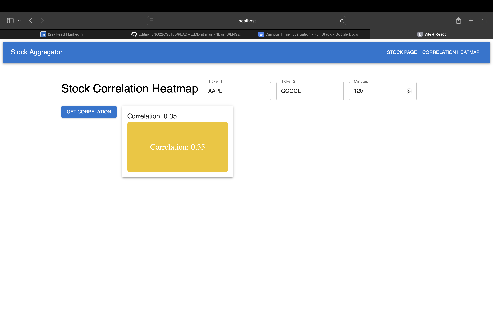
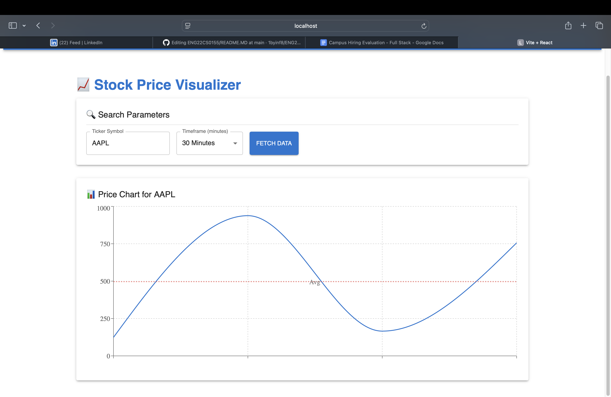

# Stock Aggregation API

This is a backend API for aggregating and analyzing stock price data. The API allows users to fetch stock prices, calculate correlation between the prices of two different stocks, and handle minute-level aggregation of stock data.

## Features

* **Fetch Stock Data by Ticker**: Retrieve stock price data for a given stock ticker symbol.
* **Calculate Correlation**: Retrieve correlation between the prices of two stocks over a specified minute interval.
* **Data Aggregation**: Aggregate stock prices by minute and compute averages.

## Endpoints

### 1. `/stocks/ticker`

**Method**: `GET`

**Description**: Fetch stock data for a given ticker symbol and aggregate it by minute.

**Query Parameters**:

* `ticker`: The stock ticker symbol (required).
* `minutes`: The interval in minutes for aggregation (required).
* `aggregation`: The type of aggregation (currently only supports `'average'`).

**Response**:

* **200 OK**: Returns the average stock price and the raw data.
* **400 Bad Request**: If a required parameter is missing or invalid.
* **404 Not Found**: If stock data is not found for the given ticker.
* **500 Internal Server Error**: If an error occurs while fetching the data.

**Example Request**:

```bash
GET http://localhost:3000/stocks/ticker?ticker=AAPL&minutes=15&aggregation=average
```

**Example Response**:

```json
{
  "averagePrice": 135.67,
  "data": [
    {"price": 135.50, "lastUpdatedAt": "2025-05-14T06:43:41.928586518Z"},
    {"price": 135.85, "lastUpdatedAt": "2025-05-14T06:55:41.928362924Z"}
  ]
}
```

---

### 2. `/stocks/stockcorrelation`

**Method**: `GET`

**Description**: Calculate the correlation between the prices of two stocks over a given minute interval.

**Query Parameters**:

* `ticker`: The first stock ticker symbol (required).
* `ticker2`: The second stock ticker symbol (required).
* `minutes`: The interval in minutes for aggregation (required).

**Response**:

* **200 OK**: Returns the correlation between the two stocks, along with their price history and average price.
* **400 Bad Request**: If a required parameter is missing or invalid.
* **404 Not Found**: If stock data is not found for the given tickers.
* **500 Internal Server Error**: If an error occurs while fetching the data.

**Example Request**:

```bash
GET http://localhost:3000/stocks/stockcorrelation?ticker=AAPL&ticker2=GOOGL&minutes=15
```

**Example Response**:

```json
{
  "correlation": 0.85,
  "stocks": {
    "AAPL": {
      "avgPrice": 135.67,
      "priceHistory": [
        {"price": 135.50, "lastUpdatedAt": "2025-05-14T06:43:41.928586518Z"},
        {"price": 135.85, "lastUpdatedAt": "2025-05-14T06:55:41.928362924Z"}
      ]
    },
    "GOOGL": {
      "avgPrice": 134.25,
      "priceHistory": [
        {"price": 134.10, "lastUpdatedAt": "2025-05-14T06:43:41.928586518Z"},
        {"price": 134.50, "lastUpdatedAt": "2025-05-14T06:55:41.928362924Z"}
      ]
    }
  }
}
```

---

## Installation

1. Clone the repository:

   ```bash
   git clone https://github.com/1byinf8/ENG22CS0155.git
   cd ENG22CS0155/stock-aggregation-api
   ```

2. Install the dependencies:

   ```bash
   npm install
   ```

3. Configure environment variables (if needed). For example, you may need to specify API keys for fetching stock data.

4. Start the server:

   ```bash
   npm run dev
   ```

   The server will run on `http://localhost:3000`.

---

## Error Handling

The API responds with appropriate HTTP status codes:

* **200**: Success
* **400**: Bad Request (missing or invalid parameters)
* **404**: Not Found (if the stock data or correlation is not available)
* **500**: Internal Server Error (if something goes wrong on the server)

---

## Example Use Case

1. **Get the average stock price of AAPL over 15 minutes**:

   ```bash
   GET http://localhost:3000/stocks/ticker?ticker=AAPL&minutes=15&aggregation=average
   ```

2. **Get the correlation between AAPL and GOOGL over 15 minutes**:

   ```bash
   GET http://localhost:3000/stocks/stockcorrelation?ticker=AAPL&ticker2=GOOGL&minutes=15
   ```

---

## Technologies Used

* **Node.js**: Backend framework for handling API requests.
* **Express.js**: Web framework for building RESTful APIs.

Here’s a README file template for the frontend UI of your stock aggregation project, assuming it’s located in a separate folder (e.g., `stock-aggregation-ui`) within the repository or as a separate project.

---

# Stock Aggregation UI

This is the frontend for the Stock Aggregation API. The UI allows users to input stock tickers, specify time intervals, and view the stock data, along with its correlation with other stock prices, displayed in an easy-to-understand format.

## Features

* **Input for Stock Tickers**: Allows the user to input two stock ticker symbols.
* **Input for Time Interval**: Users can specify the minute interval for stock data aggregation.
* **Correlation Heatmap**: Displays a heatmap showing the correlation between two stock prices.
* **Error Handling**: Shows appropriate error messages if data is not found or if an invalid request is made.

## Installation

To get the UI up and running locally, follow the steps below:

1. Clone the repository:

   ```bash
   git clone https://github.com/1byinf8/ENG22CS0155.git
   cd ENG22CS0155/stock-aggregation-ui
   ```

2. Install dependencies:

   ```bash
   npm install
   ```

3. Start the development server:

   ```bash
   npm start
   ```

   The UI will be available at `http://localhost:5173`.

---

## Components

### 1. **CorrelationPage.js**

This is the main page where users can input two stock tickers and a minute interval to fetch the correlation data and view the heatmap.

#### Key Features:

* **TextField Components**: For users to input stock tickers and minute intervals.
* **Button Component**: To trigger fetching of correlation data.
* **Grid Layout**: Used for arranging the UI components responsively.
* **HeatMapChart**: Displays the correlation heatmap once data is fetched.

---

### 2. **HeatMapChart.js**

This component displays the heatmap based on the correlation data fetched from the backend.

---

### 3. **Error Handling**

If the API fails to fetch the data or there are issues with the input, error messages will be displayed in a Snackbar.

---

## UI Flow

### 1. **Initial View**:

* Users see input fields for `Ticker 1`, `Ticker 2`, and `Minutes`.
* There is a "Get Correlation" button that, when clicked, triggers the API request.

### 2. **Submitting Data**:

* When the user clicks the button, the data is sent to the backend via a GET request (`/stocks/stockcorrelation`).

### 3. **Displaying Results**:

* If the API request is successful, the correlation value is displayed.
* A heatmap chart is rendered based on the correlation value.

### 4. **Error Handling**:

* If no data is found or there is an issue, an error message is displayed in the form of a Snackbar at the bottom of the UI.

---

## Technologies Used

* **React.js**: Frontend library for building the user interface.
* **MUI**: Material-UI library for responsive design and components like TextField, Button, Snackbar, etc.
* **Axios**: For making HTTP requests to the backend API.
* **React Router**: For handling any potential page navigation (if used in your project).

---

## Example Usage

1. **Fetch Correlation between AAPL and GOOGL**:

   * Input `AAPL` for Ticker 1, `GOOGL` for Ticker 2, and `15` for Minutes.
   * Click the "Get Correlation" button to view the correlation and the heatmap.

2. **Error Example**:

   * If invalid tickers are entered or the API is down, an error message will show in a Snackbar at the bottom of the page.

---

## Running the Project

1. Clone the repository.
2. Navigate to the frontend project folder (`stock-aggregation-ui`).
3. Install dependencies using `npm install`.
4. Run the app using `npm run dev`.
